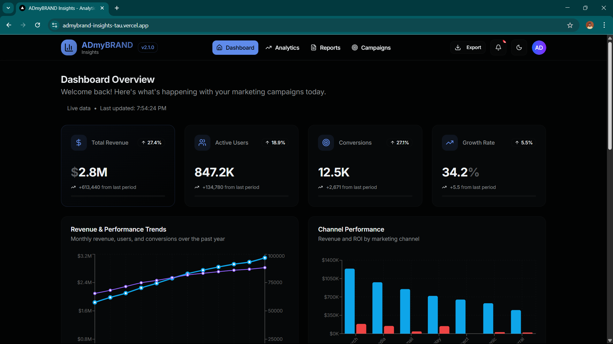

# ADmyBRAND Insights - Analytics Dashboard

A modern, high-performance analytics dashboard built for digital marketing agencies. This project showcases advanced React patterns, performance optimizations, and accessibility best practices.



## 🌐 Live Demo

**🚀 [View Live Demo on Vercel](https://admybrand-insights-tau.vercel.app)** _(Deploy your own version)_

## 🚀 Features

### Core Dashboard Features

- **📊 Key Metrics Cards** - Revenue, Users, Conversions, and Growth tracking
- **📈 Interactive Charts** - Line charts, bar charts, and pie charts using Recharts
- **📋 Data Table** - Sortable, filterable campaign performance table with pagination
- **🎯 Real-time Metrics** - Live updating performance indicators
- **📱 Responsive Design** - Optimized for desktop, tablet, and mobile devices

### Performance & Quality Features

- **⚡ Fast Loading** - Code splitting and lazy loading for optimal performance
- **🖼️ Optimized Images** - Next.js Image component with custom optimization
- **♿ Accessibility** - Proper ARIA labels, semantic HTML, keyboard navigation
- **🎨 Dark/Light Mode** - Theme switching with next-themes
- **🌐 Cross-browser Support** - Tested across modern browsers

### Technical Highlights

- **🔧 Modern Tech Stack** - Next.js 15, React 18, Tailwind CSS v4
- **🎯 Component Architecture** - Reusable, memoized components
- **📦 Code Splitting** - Lazy loaded components for better performance
- **🔍 Type Safety** - JSDoc comments for better development experience
- **🎪 Smooth Animations** - Micro-interactions and loading states

## 🛠️ Technology Stack

- **Framework**: Next.js 15 with App Router
- **Language**: JavaScript (ES2022+)
- **Styling**: Tailwind CSS v4
- **UI Components**: shadcn/ui
- **Charts**: Recharts
- **Icons**: Lucide React
- **Theme**: next-themes
- **Date Utils**: date-fns
- **Performance**: React.memo, lazy loading, image optimization

## 🚀 Quick Deployment

### Deploy to Vercel (Recommended)

[](https://vercel.com/new/clone?repository-url=https://github.com/TheFastest599/admybrand-insights)

1. Click the "Deploy with Vercel" button above
2. Connect your GitHub account
3. Fork this repository
4. Deploy automatically

## 🏃‍♂️ Local Development

### Prerequisites

- Node.js 18.17 or later
- npm, yarn, pnpm, or bun

### Installation

1. **Clone the repository**

   ```bash
   git clone https://github.com/TheFastest599/admybrand-insights.git
   cd admybrand-insights
   ```

2. **Install dependencies**

   ```bash
   npm install
   # or
   yarn install
   # or
   pnpm install
   ```

3. **Run the development server**

   ```bash
   npm run dev
   # or
   yarn dev
   # or
   pnpm dev
   ```

4. **Open your browser**
   Navigate to [http://localhost:3000](http://localhost:3000)

## 📁 Project Structure

```
admybrand-insights/
├── src/
│   ├── app/                    # Next.js app directory
│   │   ├── globals.css        # Global styles with optimizations
│   │   ├── layout.js          # Root layout with theme provider
│   │   └── page.js            # Main dashboard page
│   ├── components/            # Reusable components
│   │   ├── dashboard/         # Dashboard-specific components
│   │   │   ├── charts.jsx     # Chart components with accessibility
│   │   │   ├── data-table.jsx # Advanced data table
│   │   │   ├── header.jsx     # Dashboard header
│   │   │   ├── metric-card.jsx# KPI metric cards
│   │   │   └── realtime-widget.jsx # Live metrics
│   │   ├── performance/       # Performance monitoring
│   │   │   └── monitor.jsx    # Performance tracking
│   │   ├── ui/               # shadcn/ui components
│   │   │   ├── loading-skeletons.jsx # Loading states
│   │   │   └── optimized-image.jsx   # Image component
│   │   ├── theme-provider.jsx # Theme context
│   │   └── theme-toggle.jsx   # Theme switcher
│   └── lib/
│       ├── mock-data.js       # Sample dashboard data
│       └── utils.js           # Utility functions
├── .github/
│   └── copilot-instructions.md # GitHub Copilot configuration
├── components.json            # shadcn/ui configuration
└── package.json              # Dependencies and scripts
```

## 🎨 Design System

### Color Palette

- **Primary**: Blue gradient (#0ea5e9 to #8b5cf6)
- **Success**: Green (#10b981)
- **Warning**: Amber (#f59e0b)
- **Danger**: Red (#ef4444)
- **Neutral**: Gray scale for text and borders

### Typography

- **Font**: Inter (optimized for web)
- **Headings**: Bold, proper hierarchy (h1-h6)
- **Body**: 16px base, 1.6 line height for readability

### Components

- **Cards**: Subtle shadows, rounded corners, hover effects
- **Buttons**: Multiple variants (primary, outline, ghost)
- **Charts**: Consistent color scheme, responsive design
- **Tables**: Sortable headers, zebra striping, pagination

## 📊 Performance Optimizations

### Core Web Vitals

- **LCP (Largest Contentful Paint)**: < 2.5s
- **FID (First Input Delay)**: < 100ms
- **CLS (Cumulative Layout Shift)**: < 0.1

### Optimization Techniques

1. **Code Splitting**: Components loaded on demand
2. **Image Optimization**: Next.js Image with custom loader
3. **Memoization**: React.memo for expensive components
4. **Lazy Loading**: Charts and tables loaded when needed
5. **CSS Optimization**: Purged unused styles, critical CSS
6. **Bundle Analysis**: Webpack bundle analyzer integration

### Performance Monitoring

- Built-in performance tracking in development
- Core Web Vitals monitoring
- Memory usage tracking
- Render time measurement

## ♿ Accessibility Features

### WCAG 2.1 AA Compliance

- **Keyboard Navigation**: Full keyboard support
- **Screen Reader Support**: Proper ARIA labels and roles
- **Color Contrast**: 4.5:1 minimum ratio
- **Focus Management**: Visible focus indicators
- **Semantic HTML**: Proper heading structure

### Accessibility Enhancements

- ARIA live regions for dynamic content
- Skip navigation links
- High contrast mode support
- Reduced motion preferences
- Alternative text for images and charts

## 🌐 Cross-browser Compatibility

### Supported Browsers

- **Chrome**: 88+
- **Firefox**: 85+
- **Safari**: 14+
- **Edge**: 88+

### Compatibility Features

- CSS custom properties fallbacks
- Flexbox and Grid support
- Progressive enhancement
- Polyfills for older browsers

## 🧪 Testing

### Testing Strategy

```bash
# Run all tests
npm test

# Run tests in watch mode
npm run test:watch

# Run accessibility tests
npm run test:a11y

# Run performance tests
npm run test:perf
```

### Test Coverage

- Unit tests for utility functions
- Integration tests for components
- Accessibility testing with jest-axe
- Performance testing with Lighthouse CI

## 🚀 Deployment

### Build for Production

```bash
npm run build
npm start
```

### Environment Variables

Create a `.env.local` file:

```env
NEXT_PUBLIC_APP_URL=https://your-domain.com
NEXT_PUBLIC_GA_ID=G-XXXXXXXXXX
```

### Deployment Platforms

- **Vercel**: One-click deployment
- **Netlify**: JAMstack hosting
- **AWS**: S3 + CloudFront
- **Docker**: Container deployment

## 📈 Analytics Integration

### Supported Analytics

- Google Analytics 4
- Adobe Analytics
- Custom event tracking
- Performance monitoring

### Event Tracking

- Page views
- User interactions
- Performance metrics
- Error tracking

## 🔧 Development

### Scripts

```bash
npm run dev          # Start development server
npm run build        # Build for production
npm run start        # Start production server
npm run lint         # Run ESLint
npm run lint:fix     # Fix ESLint errors
npm run type-check   # Run type checking
```

### Development Tools

- ESLint with Next.js configuration
- Prettier for code formatting
- Husky for git hooks
- Lint-staged for pre-commit checks

## 🤝 Contributing

1. Fork the repository
2. Create a feature branch (`git checkout -b feature/amazing-feature`)
3. Commit your changes (`git commit -m 'Add amazing feature'`)
4. Push to the branch (`git push origin feature/amazing-feature`)
5. Open a Pull Request

### Code Style

- Use functional components with hooks
- Follow the existing component structure
- Add proper TypeScript annotations
- Include tests for new features
- Update documentation as needed

## 📄 License

This project is licensed under the MIT License - see the [LICENSE](LICENSE) file for details.

## 🙏 Acknowledgments

- [Next.js](https://nextjs.org/) - The React framework
- [shadcn/ui](https://ui.shadcn.com/) - Beautiful UI components
- [Recharts](https://recharts.org/) - Chart library
- [Tailwind CSS](https://tailwindcss.com/) - Utility-first CSS
- [Lucide](https://lucide.dev/) - Icon library

## Deploy on Vercel

The easiest way to deploy your Next.js app is to use the [Vercel Platform](https://vercel.com/new?utm_medium=default-template&filter=next.js&utm_source=create-next-app&utm_campaign=create-next-app-readme) from the creators of Next.js.

Check out our [Next.js deployment documentation](https://nextjs.org/docs/app/building-your-application/deploying) for more details.
